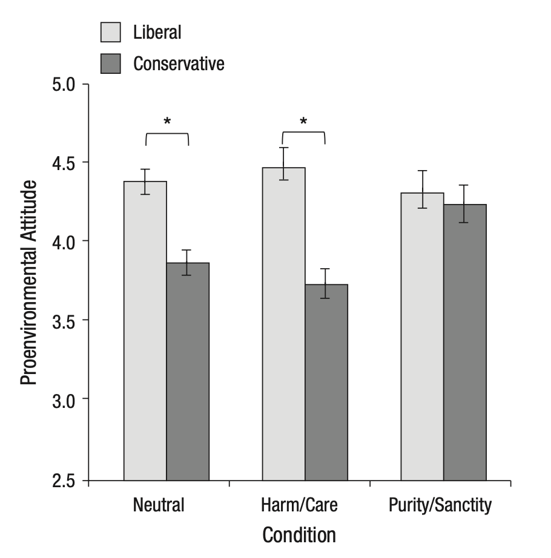

[link to repository](https://github.com/psych251/feinberg2012/tree/main)

[link to original paper](https://github.com/psych251/feinberg2012/blob/main/original_paper/feinberg-willer-2012-the-moral-roots-of-environmental-attitudes.pdf)

[link to preview the survey]https://stanforduniversity.qualtrics.com/jfe/preview/previewId/c7925870-fb66-4dcb-bcac-aaa3cfa95694/SV_bK1wMQAbLJPkcwS?Q_CHL=preview&Q_SurveyVersionID=current

Note to TAs: this replication will be done in collaboration with a friend of mine, using his sources of funding, as he is also interested in whether this study will replicate. We will be adding in an additional control condition, but the nature of the analyses used in the original study will mean that this work will both demonstrate whether the original study replicates and also show any results from the additional control conditions. We will still just be focusing on Study 3, and primary attention will be paid to the "Environmental attitudes and policy preferences" section of Study 3, but disgust and its potential mediating role will also be measured. 
My friend also added in some additional questions at the end. As these come after the replication, they won't have any effect on the replication. Feel free to just ignore them.

## Introduction

This project aims to both determine whether the findings of Study 3 replicate. It additionally aims to assess whether the nature of the control condition used in the original study affected these findings, by adding in a control condition that focuses on environmental topics without using moralized language.

## Methods

### Power Analysis

There's no option for a multiple regression with multiple regression coefficients in G*Power :(.

### Planned Sample

Sample size - 1000. 

### Materials

The experimental articles:

"The harm/care message described the harm and destruction humans are causing to the environment and emphasized how important it is for people to care about and protect the environment. Participants in the purity/sanctity condition read about how polluted and contaminated the environment has become and how important it is for people to clean and purify the environment. Additionally, three small pictures were presented with the persuasive messages. The purity/sanctity pictures showed a cloud of pollution looming over a city, a person drinking contaminated water, and a forest covered in garbage. The harm/care pictures showed a destroyed forest of tree stumps, a barren coral reef, and cracked land suffering from drought. Importantly, both messages ended positively, providing information regarding what people can do to improve the environment"

The control article:

"Participants in the neutral condition read an apolitical message on the history of neckties."

One additional control article, created by my friend and myself, will be added. This article talks about the environment/climate change but uses morally neutral language.

### Procedure	

The original study was described as follows:

"Participants completed a demographic questionnaire...Participants in the harm/care and purity/sanctity conditions read a persuasive message modeled after a newspaper op-ed. These messages utilized words typi- cal of their respective moral domains...Participants in the neutral condition read an apolitical message on the history of neckties...After reading the message, participants indicated how much they felt five emotions, including disgust...Participants then completed a 3-item measure of proenvironmental attitudes, a 5-item mea- sure of support for proenvironmental legislation, and a 3-item measure of belief in global warming."

My replication will differ from this in the following way: there will one additional control condition with a message about the environment and climate change that uses morally neutral language. This will allow for a deeper understanding of whether it was specifically the morally valenced language that had an effect on conservatives' pro-environmental attitudes.

Additionally, we will be including some attention checks, but not filtering on them, because the original study did not filter on attention checks.

### Analysis Plan

Multiple regression analysis that compares the interactions between each of the five conditions and political ideology. Simple slopes analyses comparing both conservatives across conditions, and comparing liberals across conditions, as well as comparing conservatives and liberals within each condition. 

### Differences from Original Study

The addition of the control conditions is an obvious difference, but the multiple regression analysis will still allow for the same results to be calculated. 

### Methods Addendum (Post Data Collection) 

#### Actual Sample

#### Differences from pre-data collection methods plan

## Results

### Data preparation

For repeat survey-takers, include the data from the first time they took the survey but exclude all other data. 

```{r include = F, message = F}

#### Load Relevant Libraries and Functions
library(tidyverse)
library(qualtRics)
library(reghelper)

```

```{r include=T, message = F}
### Data Preparation

#### Import data
d <- read_survey('~/Desktop/Test_data.csv')

#### Data exclusion / filtering

d$fail <- (rowSums(d %>% select(fail_ck_1, fail_ck_2)))

#### Prepare data for analysis - create columns etc.

d$harm <- as.factor(ifelse(d$condition=="lib_exp", 1, 0))

d$orig <- as.factor(ifelse(d$condition=="orig_con", 1, 0))

d$newcon <- as.factor(ifelse(d$condition=="env_con", 1, 0))

d$ideology <- scale(d$Pol_ideology)[,1]

d$attitude <- rowSums(d %>%
 select(starts_with("GW"), GHG_reduc, Protect_env, Env_rank)) / 8


```

### Confirmatory analysis

Multiple regression analysis that compares the interactions between each of the four conditions and political ideology. 

Simple slopes analyses comparing both conservatives across conditions, and comparing liberals across conditions, as well as comparing conservatives and liberals within each condition. (haven't added this in yet because I'm trying to figure out whether there's a better way to represent this than simple slopes. it's very unintuitive in the original paper)

NOTE: the test analysis here used randomly generated data from Qualtrics, as I would have needed a lot of friends to take this survey if I wanted to properly conduct this analysis! Thus, it is unsurprising that there is no effect found :).

````{r include = T}

#calculating the significance of ideology x condition with simple slopes. icky syntax because the simple slopes function sucks, you basically have to rerun the model with the interaction terms ordered in a different way to get the ss estimate for each condition

harm_slopes_model = lm(attitude~harm*ideology+orig*ideology+newcon*ideology, data = d)

harm_slopes <- simple_slopes(harm_slopes_model, levels = list(ideology = "sstest"))

orig_slopes_model = lm(attitude~orig*ideology+harm*ideology+newcon*ideology, data = d)

orig_slopes <- simple_slopes(orig_slopes_model, levels = list(ideology = "sstest"))

newcon_slopes_model = lm(attitude~newcon*ideology+orig*ideology+harm*ideology, data = d)

newcon_slopes <- simple_slopes(newcon_slopes_model, levels = list(ideology = "sstest"))

harm_sig = harm_slopes[2,7]

orig_sig = orig_slopes[2,7]

newcon_sig = newcon_slopes[2,7]

purity_sig = harm_slopes[1,7]

````

```{r include=T}

#recreating figure 2 from the paper, the main (and only) figure for this study

model = lm(attitude~harm*ideology+orig*ideology+newcon*ideology, data = d)

pred_df <- expand.grid("ideology" = c(-1, 1), "harm" = as.factor(c(0, 1)), "orig" = as.factor(c(0,1)), "newcon" = as.factor(c(0,1)))

pred_df = pred_df %>% filter(!((newcon == 1 & harm == 1) | (newcon == 1 & orig == 1) | (orig == 1 & harm == 1)))

predictions <- predict(model, pred_df, interval = "confidence", se.fit =T)

purity <- as.factor(ifelse(pred_df$harm == 0 & pred_df$orig == 0 & pred_df$newcon == 0, 1, 0))

results <- data.frame(pred_df, purity, predictions$fit, predictions$se.fit)

results$significance <- ifelse(results$purity == 1, purity_sig, ifelse(results$harm == 1, harm_sig, ifelse(results$orig == 1, orig_sig, newcon_sig)))

results$condition <- ifelse(results$purity == 1, 1, ifelse(results$harm == 1, 2, ifelse(results$orig == 1, 3, 4)))

ggplot(results, aes(x = as.factor(condition), fill = as.factor(ideology), y = fit)) +
  geom_col(position = "dodge") + scale_x_discrete("Condition", labels = c("Purity", "Harm", "Original Control", "New Control")) + 
  labs(fill = "Ideology", y = "Proenvironmental Attitude") + 
  geom_errorbar(aes(ymin = fit - predictions.se.fit, ymax = fit + predictions.se.fit), width = 0.2, position = position_dodge(0.9)) + 
  scale_fill_manual(values = c("grey80", "grey20"), labels =c("liberal", "conservative")) 
```


````{r include = T}

```


```


*Side-by-side graph with original graph is ideal here*

### Exploratory analyses

Will be conducting the above analyses also to measure the effect of treatment on level of disgust. Will also be conducting the same disgust mediated moderation analysis (still trying to figure out exactly how to code this up, as it's a little confusing). These are identical to the analyses conducted in the original paper.

## Discussion

### Summary of Replication Attempt

Open the discussion section with a paragraph summarizing the primary result from the confirmatory analysis and the assessment of whether it replicated, partially replicated, or failed to replicate the original result.  

### Commentary

Add open-ended commentary (if any) reflecting (a) insights from follow-up exploratory analysis, (b) assessment of the meaning of the replication (or not) - e.g., for a failure to replicate, are the differences between original and present study ones that definitely, plausibly, or are unlikely to have been moderators of the result, and (c) discussion of any objections or challenges raised by the current and original authors about the replication attempt.  None of these need to be long.
